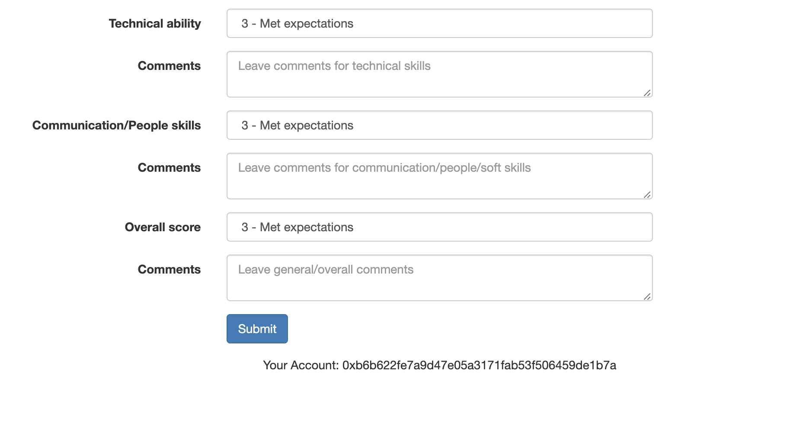

# MyFeedback

**About**

MyFeedback is a simple Distributed Application (dapp) that allows a user who is requesting feedback (ie a job candidate, employee, etc) to receive feedback from reviewers. MyFeedback is written in Javascript and Solidity, and runs on an Ethereum Virtual Machine (EVM)

You can leave feedback for me, the author, at [https://myfeedback.willshu.com](https://myfeedback.willshu.com/), which is running off the code in this master branch (you'll need Metamask and a Ropsten test account with Ether)

**Requirements**
* Chrome browser with the [Metamask extension](https://metamask.io/)
* Account on the Ropsten test network with Ether (get some [here](https://faucet.metamask.io/))
* For the backend - Truffle Framework, NodeJS, truffle-hd-wallet

**Contract rules:**

* The user requesting feedback will be the contract owner. 
* The contract owner cannot leave feedback on himself. 
* Only the owner can access the function needed to retrieve reviews. 
* Reviewers can only leave one review
* Reviewers cannot retrieve other reviews left by others

**UI features**

UI code is located in [the src folder](src/). When the UI is loaded in the browser, [app.js](src/js/app.js) will load the current wallet address, and check it against the owner as well as a list of accounts that have already reviewed. If the address is neither, the app will load the above UI. Once a review has been submitted, or if the account is the owner, then the form will not display.
